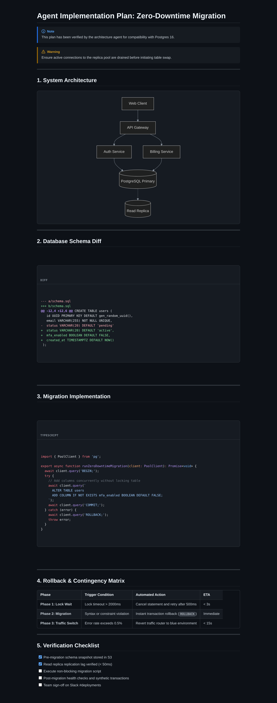
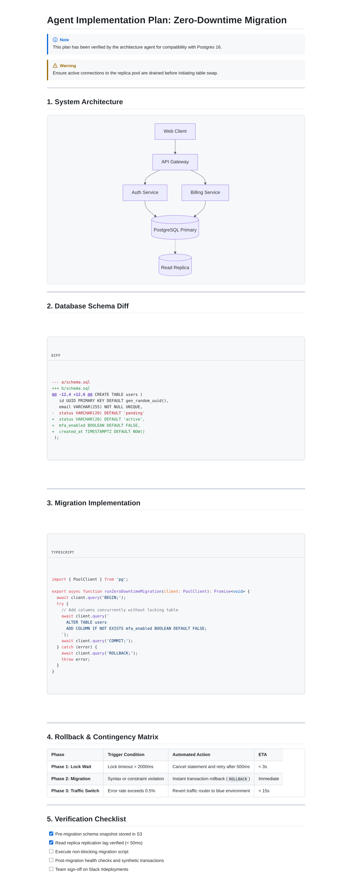

# plan-export-mcp

> **Export AI agent implementation plans and architectural audits into gorgeous, IDE-grade PDFs, high-res PNGs, and self-contained HTML files ready to share on WhatsApp, Slack, or Email.**

---

## The Problem

When coding agents (**Cursor**, **Claude Code**, **Pi**, **Windsurf**, **Aider**) draft implementation plans or audit codebases, they generate rich Markdown with code diffs, Mermaid architecture diagrams, GitHub callouts, and task lists.

- **Inside your IDE:** It looks crisp and structured.
- **When sharing:** Sending raw `.md` on **WhatsApp, Slack, or Email** turns into an unreadable mess. Generic PDF converters output 1990s-style plain black-and-white academic papers, break Mermaid diagrams, and strip dark themes.

`plan-export-mcp` bridges this gap. It gives your AI agent a native MCP tool to export plans with **pixel-perfect visual fidelity**.

---


## Key Features

- **High-Res PNG (Long Screenshot):** Rendered at 2x Retina DPR. Ideal for **WhatsApp and Slack** because it renders inline in chat feeds without forcing teammates to download a PDF reader.
- **VS Code Code Highlighting:** Powered by **Shiki** with language badges and diff support (`+` / `-` lines).
- **GitHub Callouts & Alerts:** Native support for `> [!NOTE]`, `> [!WARNING]`, `> [!TIP]`, `> [!IMPORTANT]`, and `> [!CAUTION]`.
- **Mermaid Architecture Diagrams:** Client-side vector rendering directly embedded as SVG.
- **Clean A4 PDF:** Print-optimized with background colors and screen contrast preserved.
- **Self-Contained HTML:** Embedded styles and local scripts with zero external dependencies.
- **Dual Mode:** Use it as an **MCP server** for AI agents or as a standalone **CLI tool**.

---

## Installation and Usage

### Prerequisites
- Node.js 18+
- npm, pnpm, or yarn

*(Note: HTML exports run in pure Node.js with zero browser dependencies. For PDF/PNG rendering, Puppeteer manages a lightweight headless browser automatically or uses system Chromium if present).*

---

### 1. Run with NPX (Recommended)

Runs on-demand without any global installation.

#### Claude Code (One-liner CLI)
```bash
claude mcp add plan-export npx -y plan-export-mcp
```

#### Claude Desktop & Cursor (JSON Configuration)
Add to your `claude_desktop_config.json` or `.cursor/mcp.json`:

```json
{
  "mcpServers": {
    "plan-export": {
      "command": "npx",
      "args": ["-y", "plan-export-mcp"]
    }
  }
}
```

> **Tip (Linux/Docker)**: If Puppeteer cannot locate Chrome automatically, specify its path explicitly:
> ```json
> "env": {
>   "PUPPETEER_EXECUTABLE_PATH": "/usr/bin/google-chrome-stable"
> }
> ```

---

### 2. Install Globally from NPM

Ideal for instant startup without network latency on every invocation:

```bash
npm install -g plan-export-mcp
```

```json
{
  "mcpServers": {
    "plan-export": {
      "command": "plan-export-mcp"
    }
  }
}
```

---

### 3. Install from Source (Development)

Clone the repository and build locally:

```bash
git clone https://github.com/agmonetti/plan-export-mcp.git
cd plan-export-mcp
npm install
npm run build
```

```json
{
  "mcpServers": {
    "plan-export": {
      "command": "node",
      "args": ["/path/to/plan-export-mcp/dist/index.js"]
    }
  }
}
```

---

### Standalone CLI Usage

You can also run it directly in your terminal:

```bash
# Export to PNG and PDF in dark mode
npx plan-export-mcp docs/plan.md --theme dark

# Export to all formats in light mode
npx plan-export-mcp docs/plan.md --theme light --formats png,pdf,html --output-dir exports/
```

---

## MCP Tool Reference: `export_plan`

Your AI agent can invoke this tool directly:

```typescript
{
  "input": "docs/plans/feature-auth.md", // or raw markdown string
  "theme": "dark",                       // "dark" | "light" (default: "dark")
  "formats": ["png", "pdf"],             // ["png", "pdf", "html"]
  "outputDir": "./exports",              // default: "./exports"
  "outputName": "auth-plan"              // default: derived from file
}
```

---

## Architecture

- **Runtime:** Node.js (>= 18) + TypeScript
- **MCP SDK:** `@modelcontextprotocol/sdk` (stdio transport)
- **Highlighter:** Shiki (VS Code TextMate engine)
- **Diagrams:** Mermaid.js
- **Headless Engine:** Puppeteer with intelligent fallback to system Chrome/Chromium.

---
## Preview

| Dark Theme (GitHub Dark / VS Code style) | Light Theme (GitHub Light style) |
|:---:|:---:|
|  |  |

## License

MIT © 2025
