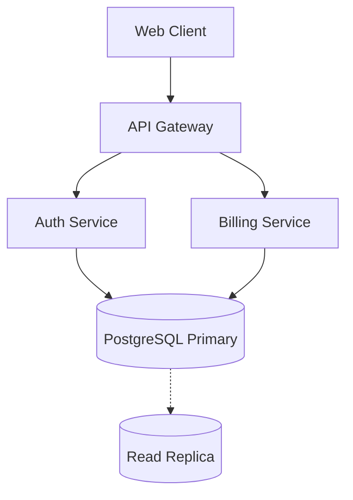

# Agent Implementation Plan: Zero-Downtime Migration

> [!NOTE]
> This plan has been verified by the architecture agent for compatibility with Postgres 16.

> [!WARNING]
> Ensure active connections to the replica pool are drained before initiating table swap.

---

## 1. System Architecture



---

## 2. Database Schema Diff

```diff
--- a/schema.sql
+++ b/schema.sql
@@ -12,4 +12,6 @@ CREATE TABLE users (
   id UUID PRIMARY KEY DEFAULT gen_random_uuid(),
   email VARCHAR(255) NOT NULL UNIQUE,
-  status VARCHAR(20) DEFAULT 'pending'
+  status VARCHAR(20) DEFAULT 'active',
+  mfa_enabled BOOLEAN DEFAULT FALSE,
+  created_at TIMESTAMPTZ DEFAULT NOW()
 );
```

---

## 3. Migration Implementation

```typescript
import { PoolClient } from 'pg';

export async function runZeroDowntimeMigration(client: PoolClient): Promise<void> {
  await client.query('BEGIN;');
  try {
    // Add columns concurrently without locking table
    await client.query(`
      ALTER TABLE users 
      ADD COLUMN IF NOT EXISTS mfa_enabled BOOLEAN DEFAULT FALSE;
    `);
    await client.query('COMMIT;');
  } catch (error) {
    await client.query('ROLLBACK;');
    throw error;
  }
}
```

---

## 4. Rollback & Contingency Matrix

| Phase | Trigger Condition | Automated Action | ETA |
| :--- | :--- | :--- | :--- |
| **Phase 1: Lock Wait** | Lock timeout > 2000ms | Cancel statement and retry after 500ms | < 3s |
| **Phase 2: Migration** | Syntax or constraint violation | Instant transaction rollback (`ROLLBACK`) | Immediate |
| **Phase 3: Traffic Switch** | Error rate exceeds 0.5% | Revert traffic router to blue environment | < 15s |

---

## 5. Verification Checklist

- [x] Pre-migration schema snapshot stored in S3
- [x] Read replica replication lag verified (< 50ms)
- [ ] Execute non-blocking migration script
- [ ] Post-migration health checks and synthetic transactions
- [ ] Team sign-off on Slack #deployments
